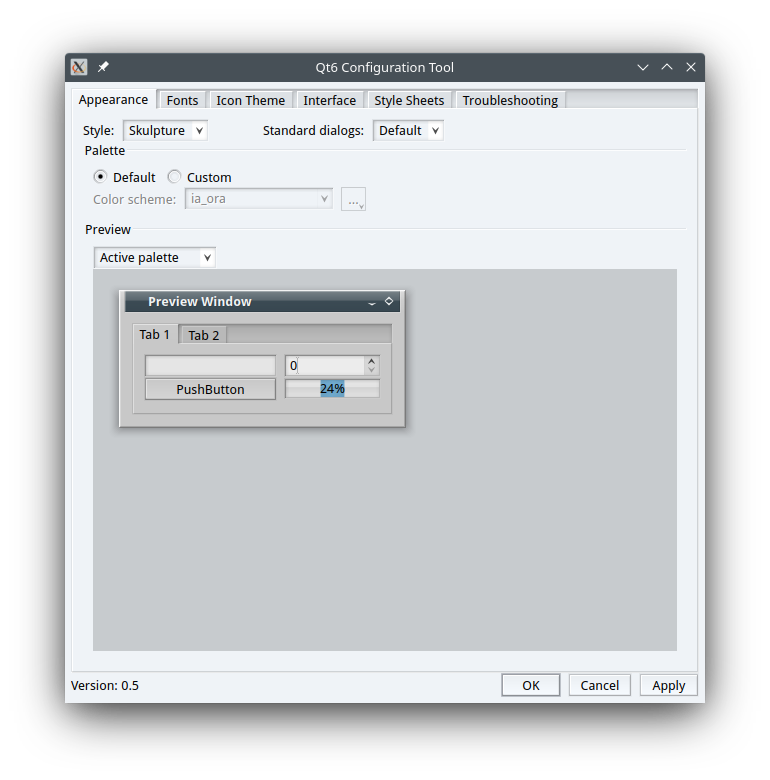

# Welcome to the humble Skulpture-five (and six!) repository...


## What is it all about
This is a re-worked and partially updated code of the original Skulpture style 
that was once developed by Christoph Feck. Specifically, this repo is a continuation of the
[`skulpture-five`](https://github.com/cfeck/skulpture/tree/five) (a Qt5/KF5 port) branch from 2016.

## What is available
As of now, the following features are present:
- an updated code base with fewer warnings during compilation
- Qt5 support
- Qt6 support

## Dropped features
Compared to the original Skulpture style for KDE4, this version lacks the following features:
- no GUI for configuration tweaks (but `~/.config/SkulptureStyle.ini` is still supported)
- obviously no Kwin decorator part

## Known issues
- Right now you can experience weird indents and paddings in menus, lists etc.


## Compilation and first steps
You'll need at least Qt 5.15.2 or 6.2.0.
Use Cmake to build this repo:
```bash
mkdir build
cd build
cmake ..
make
sudo make install
```

By default, this will build the Qt5 version. If you want the Qt6 version, use the following command:

```bash
cmake -DUSE_QT6=ON ..
```

The style is available for use once there is the `skulpture.so` file in the Qt Plugins directory in the `styles` subdirectory.
Eg., it is `/usr/lib64/qt5/plugins/styles/` for Qt5 version and `/usr/lib64/qt6/plugins/styles/skulpture.so` for Qt6
in my system, though your setup may have different paths.
If you're running Plasma5, you'll be able to find Skulpture under pedestrian Style settings in KDE's `systemsettings5`. For Qt6 apps you'll probably need
to use [Qt6ct](https://github.com/trialuser02/qt6ct). Don't forget to cast `QT_QPA_PLATFORMTHEME=qt6ct` to make it work.

## Motivation
First of all I should give my regards to [Michael Abaev](https://github.com/Lemontyash), a promising C++ coder who made the Qt6 port of Skulpture happen.
As I'm not a programmer myself, my part was to inspire and convince him to do the job, then to make the work public and provide some documentation.

The purpose of this repo is to provide a working Qt6 port of Skulpture. Even though it's not pixel-perfect
copy of its namesake for KDE4, it already provides great consistency between Qt5 and Qt6 apps. As the time goes by,
more and more apps are getting ported to Qt6 (qBittorrent, Strawberry etc), so that we need one style to fit 'em all.
Think of Skulpture as an alternative to Kvantum, which seems to be the only third-party style supporting both Qt5 and Qt6.
Your contribution and improvement in the Skulpture style will be strongly welcomed and appreciated!
